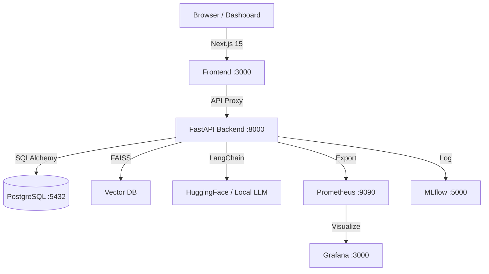

# ⚡ EnergyOps AI — Full-Stack GenAI Energy Analytics Platform

A sophisticated, high-performance platform for renewable energy operations. Featuring a **FastAPI** backend, **Next.js** dashboard, **RAG pipeline**, **Prometheus/Grafana** monitoring, and **MLflow** experiment tracking.


---

## 📋 Table of Contents

1. [🚀 Project Overview](#-project-overview)
2. [🏗️ Architecture](#︎-architecture)
3. [📁 Project Structure](#-project-structure)
4. [🛠️ Prerequisites](#️-prerequisites)
5. [📦 Quick Start (Docker)](#-quick-start-docker)
6. [💻 Local Development Setup](#-local-development-setup)
7. [📊 Monitoring & Metrics](#-monitoring--metrics)
8. [🧠 RAG & AI Capabilities](#-rag--ai-capabilities)
9. [🐛 Recent Stability Fixes](#-recent-stability-fixes)
10. [☁️ Cloud Deployment](#-cloud-deployment)

---

## 🚀 Project Overview

**EnergyOps AI** is an enterprise-grade solution for renewable energy plant management.
- **Dynamic Dashboard** — Real-time visualization of solar/wind production using Next.js 15 + Recharts.
- **Intelligent RAG** — Context-aware AI assistant trained on maintenance manuals (FAISS + HuggingFace).
- **Proactive Monitoring** — Full observability stack with Prometheus and custom Grafana dashboards.
- **MLflow Tracking** — Detailed experiment logging for RAG performance and model evaluations.
- **Model Fine-Tuning** — Support for QLoRA fine-tuning on domain-specific energy instructions.

---

## 🏗️ Architecture



---

## 📁 Project Structure

```
energyops-ai/
├── frontend/                # Next.js 15 Dashboard (React, Tailwind, Recharts)
├── app/                     # FastAPI Backend Core
│   ├── api/v1/              # API Endpoints (Energy, RAG, Eval)
│   ├── core/                # Config, Metrics, Middleware
│   ├── models/              # SQLAlchemy Database Models
│   ├── schemas/             # Pydantic Response Schemas
│   └── services/            # RAG & MLflow Logic
├── data/                    # Knowledge Base (Manuals, Training Data)
├── docker-compose.yml       # Full-Stack Orchestration
├── prometheus.yml           # Monitoring Config
└── generate_data.py         # Synthetic Production Data Generator
```

---

## 🛠️ Prerequisites

- **Python 3.9+**
- **Node.js 18+** & **npm**
- **Docker Desktop**
- **HuggingFace Account** (for RAG embeddings)

---

## 📦 Quick Start (Docker)

To launch the entire platform in minutes:

```bash
# 1. Clone the repository
git clone https://github.com/Mushthaq7/energyops_ai.git
cd energyops_ai

# 2. Configure environment
cp .env.example .env
# Edit .env and add your HF_TOKEN=hf_...

# 3. Spin up the infrastructure
docker-compose up -d --build
```

**Services now live:**
- **Dashboard:** [http://localhost:3000](http://localhost:3000)
- **API Docs:** [http://localhost:8000/docs](http://localhost:8000/docs)
- **Grafana:** [http://localhost:3000](http://localhost:3000) (User: `admin` / `admin`)
- **MLflow:** [http://localhost:5000](http://localhost:5000)

---

## 💻 Local Development Setup

### Backend Setup
```bash
python3 -m venv .venv
source .venv/bin/activate
pip install -r requirements.txt
python generate_data.py
python -m uvicorn app.main:app --reload
```

### Frontend Setup
```bash
cd frontend
npm install
npm run dev
```

> **Pro Tip:** If you encounter a `403` error when generating data, ensure you've added your [HuggingFace Access Token](https://huggingface.co/settings/tokens) to the `.env` file under `HF_TOKEN`.

---

## 📊 Monitoring & Metrics

The system exposes deep operational metrics accessible via `/metrics`:

- `http_request_duration_seconds`: API latency profiles.
- `model_response_duration_seconds`: RAG retrieval vs. generation time.
- `documents_indexed_total`: Real-time RAG capacity tracking.

**Grafana Dashboards** are pre-configured to visualize these metrics directly from Prometheus.

---

## 🧠 RAG & AI Capabilities

### Asking the AI
The RAG pipeline allows maintenance engineers to ask complex operational questions:
```bash
curl -X POST http://localhost:8000/api/v1/rag/ask \
  -H "Content-Type: application/json" \
  -d '{"question": "How do I check wind turbine gearbox oil levels?"}'
```

### Evaluation
Use the built-in evaluation suite to track LLM accuracy and latency in MLflow:
```bash
python evaluate_rag.py
```

---

## 🐛 Recent Stability Fixes (v1.1)

We recently applied 10 critical stability fixes:
1. **Schema Alignment:** Fixed backend/frontend field mismatches (`power_output` → `solar_output`).
2. **Auto-DB Init:** Tables are now automatically created on API startup using `Base.metadata.create_all`.
3. **Chart Accuracy:** Production charts now properly visualize mixed Solar (Amber) and Wind (Blue) streams.
4. **Credential Safety:** Removed hardcoded local paths and users; now fully environment-driven.
5. **RAG Cleanup:** Removed "teapot" artifacts from the knowledge base to ensure technical accuracy.

---

## ☁️ Cloud Deployment

- **Azure:** Deploy via **Azure Container Apps** or **VMs** using the provided `docker-compose.yml`.
- **GCP:** Use **Cloud Run** for the API and **GCE** for the monitoring stack.

---

**Built with ❤️ for Energy Efficiency.**
FastAPI · Next.js · LangChain · Recharts · Prometheus · MLflow
