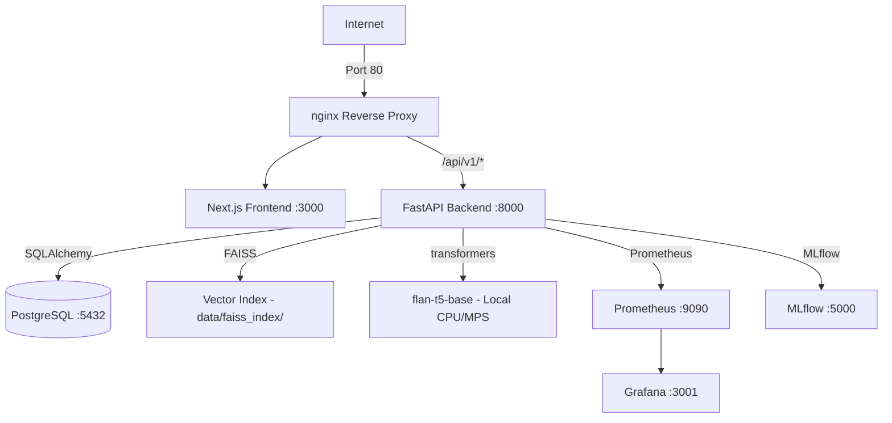

# ⚡ EnergyOps AI — Full-Stack GenAI Energy Analytics Platform

A production-ready platform for renewable energy plant operations. Features a **FastAPI** backend, **Next.js** dashboard, **local RAG pipeline** (flan-t5-base + FAISS), **nginx reverse proxy**, **Prometheus/Grafana** monitoring, and **MLflow** experiment tracking — all orchestrated via Docker Compose.

---

## 📋 Table of Contents

1. [🚀 Project Overview](#-project-overview)
2. [🏗️ Architecture](#️-architecture)
3. [📁 Project Structure](#-project-structure)
4. [🛠️ Prerequisites](#️-prerequisites)
5. [📦 Quick Start (Docker)](#-quick-start-docker)
6. [💻 Local Development Setup](#-local-development-setup)
7. [📊 Monitoring & Metrics](#-monitoring--metrics)
8. [🧠 RAG & AI Capabilities](#-rag--ai-capabilities)
9. [☁️ Cloud Deployment](#️-cloud-deployment)

---

## 🚀 Project Overview

**EnergyOps AI** is an enterprise-grade solution for renewable energy plant management.

- **Dynamic Dashboard** — Real-time solar/wind production visualization (Next.js 15 + Recharts), live trend comparisons, and anomaly alerts.
- **Local RAG Assistant** — Context-aware AI assistant powered by `google/flan-t5-base` running on-device (no API key needed) with FAISS vector search over maintenance manuals.
- **Persistent FAISS Index** — Vector index saved to disk and reloaded on startup — no rebuild on cold start.
- **Real Efficiency Metrics** — Renewable energy coverage ratio computed from actual DB data, not mocked values.
- **Proactive Monitoring** — Full observability stack with Prometheus metrics and Grafana dashboards.
- **MLflow Tracking** — Experiment logging for RAG latency, token counts, and citation counts.
- **Production-Ready** — nginx reverse proxy, gunicorn multi-worker backend, containerized frontend, rate limiting, secrets via environment variables.

---

## 🏗️ Architecture



> `/metrics` is blocked at nginx — only Prometheus (internal Docker network) can scrape it.

---

## 📁 Project Structure

```
energyops-ai/
├── frontend/                # Next.js 15 Dashboard
│   ├── src/app/             # Pages: dashboard, chat, monitoring, settings
│   ├── src/components/      # EnergyCharts, StatsCard, CitationCard, Sidebar
│   ├── src/lib/api.ts       # Typed API client
│   └── Dockerfile           # Multi-stage production build
├── app/                     # FastAPI Backend
│   ├── api/v1/endpoints/    # energy, rag, evaluation
│   ├── core/                # Config, Metrics, Middleware, Exceptions
│   ├── models/              # SQLAlchemy ORM models
│   ├── schemas/             # Pydantic response schemas
│   └── services/            # RAG (FAISS + flan-t5) & MLflow evaluation
├── data/
│   ├── documents/           # Knowledge base (.txt maintenance manuals)
│   └── faiss_index/         # Persisted FAISS vector index (auto-created)
├── nginx.conf               # Reverse proxy + rate limiting config
├── docker-compose.yml       # Full-stack orchestration (7 services)
├── Dockerfile               # Backend: gunicorn + uvicorn workers
├── prometheus.yml           # Prometheus scrape config
├── generate_data.py         # Synthetic 30-day production data generator
└── evaluate_rag.py          # MLflow RAG evaluation runner
```

---

## 🛠️ Prerequisites

- **Python 3.9+**
- **Node.js 18+** & **npm**
- **Docker Desktop** (for Docker deployment)

> No HuggingFace API key required — the RAG LLM runs locally.

---

## 📦 Quick Start (Docker)

```bash
# 1. Clone the repository
git clone https://github.com/Mushthaq7/energyops_ai.git
cd energyops-ai

# 2. Configure environment
cp .env.example .env
# Set strong values for POSTGRES_PASSWORD and GRAFANA_PASSWORD

# 3. Build and start all services
docker-compose up -d --build

# 4. Seed the database with 30 days of synthetic data
docker-compose exec api python generate_data.py
```

**Services available after startup:**

| Service | URL | Notes |
|---|---|---|
| Dashboard | http://localhost | Main entry via nginx |
| API Docs | http://localhost/api/v1/docs | Swagger UI... wait, use: http://localhost:8000/docs locally |
| Grafana | http://localhost:3001 | Login with `GRAFANA_USER` / `GRAFANA_PASSWORD` from `.env` |
| MLflow | http://localhost:5000 | Experiment tracking |
| Prometheus | http://localhost:9090 | Internal only in prod |

---

## 💻 Local Development Setup

### Backend

```bash
python3 -m venv .venv
source .venv/bin/activate
pip install -r requirements.txt

# Seed the database (requires PostgreSQL running locally)
python generate_data.py

# Start with auto-reload
python -m uvicorn app.main:app --reload
```

### Frontend

```bash
cd frontend
npm install
npm run dev
```

Both run concurrently. The frontend proxies `/api/v1/*` to `http://localhost:8000` via Next.js rewrites.

### Environment Variables

Copy `.env.example` to `.env` and fill in:

```env
POSTGRES_SERVER=localhost
POSTGRES_USER=postgres
POSTGRES_PASSWORD=your_password
POSTGRES_DB=energyops_db
POSTGRES_PORT=5432

GRAFANA_USER=admin
GRAFANA_PASSWORD=your_grafana_password

# Optional — only needed for HF embeddings auth on gated models
HF_TOKEN=hf_...
```

---

## 📊 Monitoring & Metrics

Prometheus scrapes the backend every 15 seconds. Available metrics:

| Metric | Description |
|---|---|
| `http_request_duration_seconds` | API latency by method/path |
| `http_requests_total` | Request count by status code |
| `model_response_duration_seconds` | RAG retrieval and generation time |
| `documents_indexed_total` | Documents loaded into FAISS |
| `active_requests` | In-flight request gauge |

Access Grafana at **http://localhost:3001** (Docker) to visualize these in real time.

> The `/metrics` endpoint is blocked by nginx for public traffic — only Prometheus on the internal Docker network can reach it.

---

## 🧠 RAG & AI Capabilities

### How it works

1. Maintenance `.txt` documents in `data/documents/` are chunked (500 tokens, 50 overlap) and embedded using `all-MiniLM-L6-v2`.
2. The FAISS index is built and **saved to `data/faiss_index/`** — reloaded on every restart (no rebuild needed).
3. At query time, top-3 relevant chunks are retrieved and passed as context to `google/flan-t5-base` running locally.
4. The answer and citations are returned to the frontend.

### Ask the AI

```bash
curl -X POST http://localhost:8000/api/v1/rag/ask \
  -H "Content-Type: application/json" \
  -d '{"question": "How do I check wind turbine gearbox oil levels?"}'
```

### Re-index after adding documents

Drop new `.txt` files into `data/documents/`, then:

```bash
curl -X POST http://localhost:8000/api/v1/rag/index
```

### Evaluation (MLflow)

```bash
python evaluate_rag.py
# or via API:
curl -X POST http://localhost:8000/api/v1/evaluation/evaluate \
  -H "Content-Type: application/json" \
  -d '{"questions": ["What causes solar panel degradation?"]}'
```

View results at **http://localhost:5000**.

---

## ☁️ Cloud Deployment

The entire stack runs behind nginx on port 80. To deploy on any cloud VM:

```bash
# On your server
git clone https://github.com/Mushthaq7/energyops_ai.git
cd energyops-ai
cp .env.example .env   # fill in strong passwords
docker-compose up -d --build
```

For **HTTPS**, place Caddy or Certbot in front of nginx with your domain.

**Recommended platforms:**
- **Railway / Render** — deploy backend and frontend as separate services
- **Azure Container Apps** — use the provided `docker-compose.yml`
- **GCP Cloud Run** — containerized API + frontend work out of the box

---

**Built for Energy Efficiency.**
FastAPI · Next.js · LangChain · flan-t5-base · FAISS · Recharts · Prometheus · MLflow · nginx
